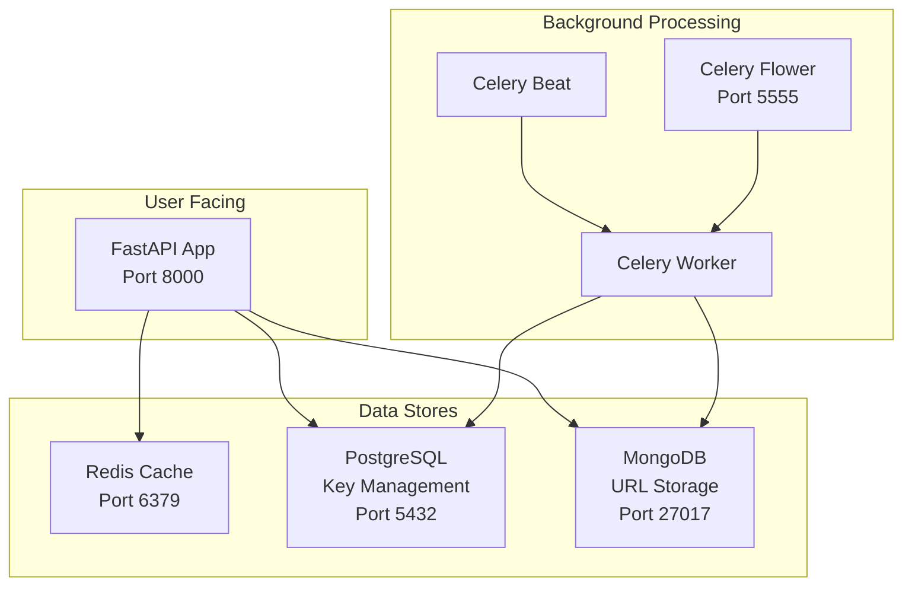

# URL Shortener - Scalable Microservice

A high-performance, scalable URL shortener service built with FastAPI, featuring Redis caching, PostgreSQL for key management, and MongoDB for URL storage.

## 🚀 Features

- **Fast URL Shortening**: Generate short URLs with pre-populated keys for instant response.
- **Redis Caching**: Lightning-fast redirects with Redis-first lookup.
- **Dual Database**: PostgreSQL for pre-populating and managing a pool of short URL keys, and MongoDB for storing the mapping between short and long URLs.
- **Background Tasks**: Celery workers for key pre-population and cleanup.
- **Monitoring**: Celery Flower dashboard for task monitoring.
- **Containerized**: Full Docker setup with docker-compose.
- **Scalable Architecture**: Microservice design ready for horizontal scaling.

## 🏗️ Architecture



## 📋 Prerequisites

- Docker and Docker Compose
- Python 3.12+ (for local development)
- Git

## 🚀 Quick Start

### Using Docker (Recommended)

1. **Clone the repository**
   ```bash
   git clone <repository-url>
   cd url_shortener_scalable
   ```

2. **Start all services**
   ```bash
   docker-compose up -d
   ```

3. **Verify services are running**
   ```bash
   docker-compose ps
   ```

4. **Access the application**
   - API: http://localhost:8000
   - Flower Dashboard: http://localhost:5555
   - API Documentation: http://localhost:8000/docs

### Local Development

1. **Create virtual environment**
   ```bash
   uv venv .venv
   source .venv/bin/activate  # On Windows: .venv\Scripts\activate
   ```

2. **Install dependencies**
   ```bash
   uv sync
   ```

3. **Set up environment variables**
   ```bash
   cp .env.example .env
   # Edit .env with your configuration
   ```

4. **Start external services**
   ```bash
   docker-compose up -d redis postgres mongo_db
   ```

5. **Run the application**
   ```bash
   uv run app.main:app --reload
   ```

## 🔧 Configuration

Key environment variables in `.env`:

| Variable | Description | Default Value |
|---|---|---|
| `MONGO_URI` | MongoDB connection string | `mongodb://localhost:27017` |
| `REDIS_HOST` | Redis host | `localhost` |
| `REDIS_PORT` | Redis port | `6379` |
| `REDIS_PASSWORD` | Redis password | ` ` |
| `DB_NAME` | PostgreSQL database name | `url_shortener` |
| `DB_HOST` | PostgreSQL host | `localhost` |
| `DB_PORT` | PostgreSQL port | `5432` |
| `DB_USER` | PostgreSQL user | `postgres` |
| `DB_PASSWORD` | PostgreSQL password | ` ` |
| `HOST` | Application host | `localhost` |
| `PORT` | Application port | `8000` |
| `BASE_URL` | Base URL for short links | `http://localhost:8000` |
| `KEY_POPULATION_COUNT` | Number of keys to pre-populate | `10` |
| `KEY_POPULATION_SCHEDULE` | Schedule for key pre-population (in seconds) | `1800` |
| `TASK_RETRY_DELAY` | Delay for retrying failed tasks (in seconds) | `60` |
| `TASK_MAX_RETRIES` | Maximum number of retries for failed tasks | `3` |
| `CLEANUP_EXPIRED_SCHEDULE` | Schedule for cleaning up expired links (in seconds) | `86400` |


## 📚 API Usage

### Create Short URL

```bash
curl -X POST "http://localhost:8000/api/v1/create" \
  -H "Content-Type: application/json" \
  -d '{
    "long_url": "https://www.example.com",
    "expires_at": "2025-12-31T23:59:59"
  }'
```

**Response:**
```json
{
  "message": "URL created successfully",
  "short_url": "http://localhost:8000/abc123",
  "long_url": "https://www.example.com",
  "expires_at": "2025-12-31T23:59:59"
}
```

### Access Short URL

Simply visit the short URL in your browser or use curl:

```bash
curl -L "http://localhost:8000/abc123"
```

This will redirect you to the original long URL.

### Health Check

```bash
curl "http://localhost:8000/health"
```

## 🛠️ Services

| Service | Port | Description |
|---------|------|-------------|
| **web_app** | 8000 | Main FastAPI application |
| **redis** | 6379 | Cache for fast URL lookups |
| **postgres** | 5432 | Primary database for URL key management |
| **mongo_db** | 27017 | Database for URL storage and analytics |
| **celery_worker** | - | Background task processor |
| **celery_beat** | - | Periodic task scheduler |
| **celery_flower** | 5555 | Task monitoring dashboard |

## 🔄 Background Tasks

The system uses Celery for background processing:

- **Key Pre-population**: Automatically generates unused short URL keys in PostgreSQL.
- **Cleanup Tasks**: Removes expired URLs and maintains database health.

Monitor tasks at: http://localhost:5555

## 🗂️ Project Structure

```
url_shortener_scalable/
├── app/
│   ├── core/              # Core configuration and utilities
│   ├── db/                # Database connections and models
│   │   ├── sql/           # PostgreSQL models and operations
│   │   └── nosql/         # MongoDB connections
│   ├── models/            # Pydantic schemas
│   ├── routes/            # API route handlers
│   ├── services/          # Business logic services
│   ├── tasks/             # Celery background tasks
│   └── main.py            # FastAPI application entry point
├── .dockerignore
├── .env
├── .gitignore
├── .python-version
├── docker-compose.yml     # Multi-service Docker setup
├── Dockerfile
├── Dockerfile.original
├── pyproject.toml        # Python dependencies and project config
├── README.md             # This file
└── uv.lock
```

## 🧪 Testing

### Manual Testing

The `README.md` provides instructions for manual testing. However, there are no automated tests in the project. It is highly recommended to add a testing framework like `pytest` and write unit and integration tests to ensure the reliability of the application.

### Load Testing

The system is designed to handle high loads through:
- Redis caching for sub-millisecond redirects
- Pre-populated URL keys for instant creation
- Horizontal scaling capabilities
- Efficient database indexing

## 🔧 Development

### Adding New Features

1. **API Endpoints**: Add routes in `app/routes/`
2. **Background Tasks**: Create tasks in `app/tasks/`
3. **Database Models**: Update models in `app/db/sql/models.py`
4. **Services**: Add business logic in `app/services/`

### Database Migrations

The application automatically initializes the PostgreSQL database on startup. For schema changes, it is recommended to use a database migration tool like `Alembic` to manage schema changes in a production environment. The current setup is suitable for development and testing only.

### Monitoring

- **Application Logs**: `docker-compose logs web_app`
- **Task Monitoring**: http://localhost:5555
- **Database Health**: Check via health endpoint

## 🚀 Deployment

### Production Considerations

1. **Environment Variables**: Use secure values in production
2. **SSL/TLS**: Configure HTTPS for production domains
3. **Database**: Use managed database services
4. **Caching**: Consider Redis Cluster for high availability
5. **Monitoring**: Add application performance monitoring
6. **Scaling**: Use container orchestration (Kubernetes, Docker Swarm)

### Docker Production

```bash
# Build production image
docker-compose -f docker-compose.prod.yml build

# Deploy with production config
docker-compose -f docker-compose.prod.yml up -d
```

## 🤝 Contributing

1. Fork the repository
2. Create a feature branch (`git checkout -b feature/amazing-feature`)
3. Commit your changes (`git commit -m 'Add amazing feature'`)
4. Push to the branch (`git push origin feature/amazing-feature`)
5. Open a Pull Request

## 📄 License

This project is licensed under the MIT License - see the LICENSE file for details.

## 🙏 Acknowledgments

- Built with [FastAPI](https://fastapi.tiangolo.com/)
- Task processing by [Celery](https://celeryproject.org/)
- Caching powered by [Redis](https://redis.io/)
- Database management with [PostgreSQL](https://postgresql.org/) and [MongoDB](https://mongodb.com/)
- Package management by [uv](https://github.com/astral-sh/uv)

---

## 📞 Support

For questions and support:
- Create an issue in the repository
- Check the API documentation at http://localhost:8000/docs
- Monitor system health at http://localhost:8000/health
