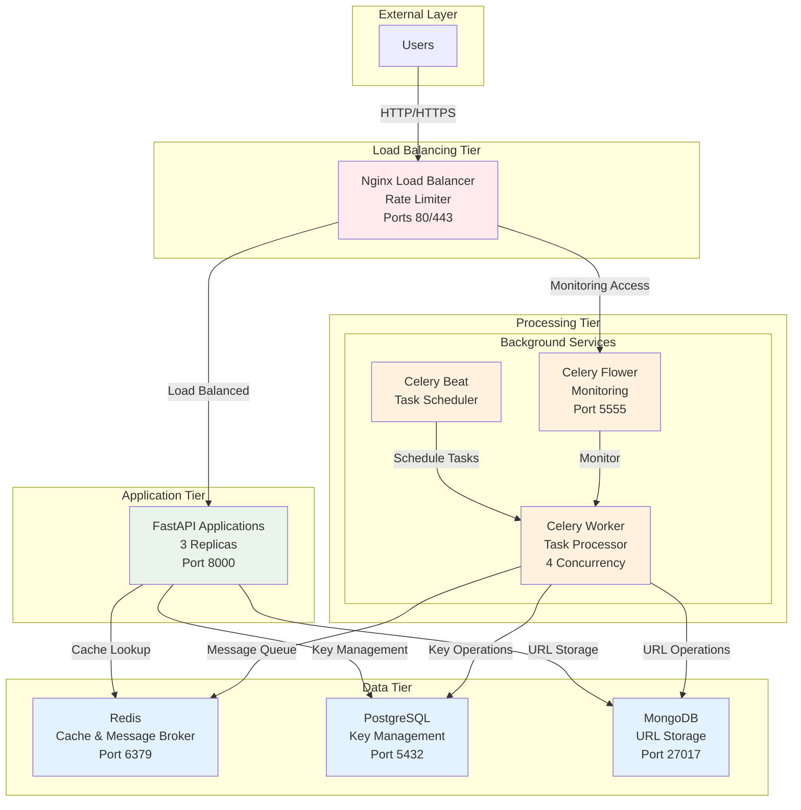
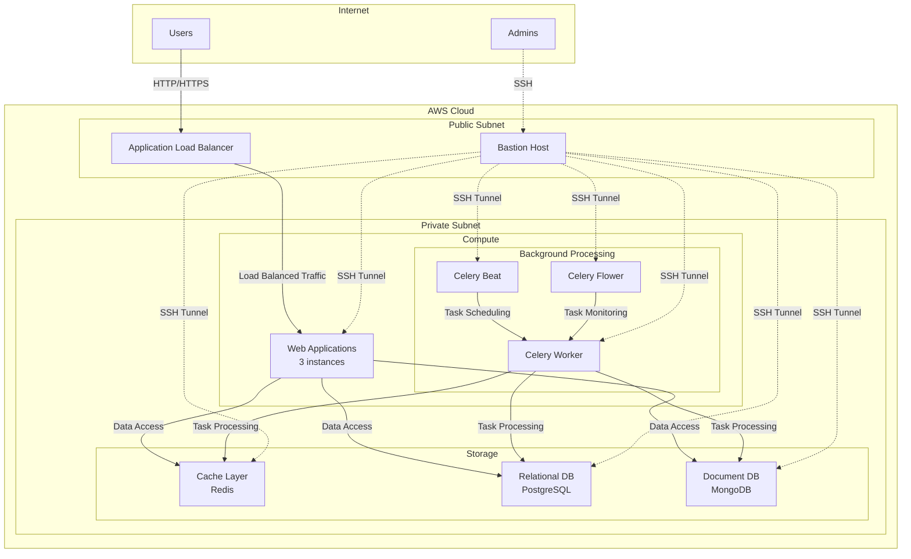

# URL Shortener - Scalable Microservice

A high-performance, scalable URL shortener service built with FastAPI, featuring Redis caching, PostgreSQL for key management, and MongoDB for URL storage.

## 🚀 Features

- **Fast URL Shortening**: Generate short URLs with pre-populated keys for instant response.
- **Redis Caching**: Lightning-fast redirects with Redis-first lookup.
- **Dual Database**: PostgreSQL for pre-populating and managing a pool of short URL keys, and MongoDB for storing the mapping between short and long URLs (MongoDB v6.0).
- **Robust Background Processing**: Celery workers with optimized database connections and heartbeat monitoring to ensure reliable task execution.
- **Automated Database Initialization**: The PostgreSQL database is automatically initialized with the required schema on startup.
- **Monitoring**: Celery Flower dashboard for task monitoring, accessible via Nginx proxy with proper static asset and API routing.
- **Automated Testing**: Comprehensive `pytest` framework with mocking for robust unit and integration tests.
- **Containerized**: Full Docker setup with docker-compose.
- **Scalable Architecture**: Microservice design ready for horizontal scaling.
- **Load Balancing and Rate Limiting**: Nginx load balancer with rate limiting and caching, including routing for FastAPI documentation and OpenAPI schema.
- **AWS Infrastructure as Code**: AWS infrastructure managed with Pulumi.

## 🏗️ Architecture

### Docker Compose Architecture



### AWS Architecture



## AWS Infrastructure

This project includes a complete AWS infrastructure defined as code using Pulumi. The infrastructure is designed to be scalable, secure, and highly available.

### Deploying the AWS Infrastructure

To deploy the AWS infrastructure, you will need to have Pulumi installed and configured with your AWS credentials. Then, navigate to the `infra` directory and run the following commands:

```bash
cd infra
pulumi up
```

This will provision all the necessary AWS resources, including:

*   A VPC with public and private subnets
*   A NAT gateway for outbound traffic from the private subnets
*   An internet gateway for inbound traffic to the public subnets
*   Security groups to control traffic between the different components
*   EC2 instances for the application, load balancer, databases, and Celery services
*   A bastion host for secure access to the private instances


### Bastion Host and SSH Tunneling

A bastion host is created in the public subnet to allow secure SSH access to the instances in the private subnet. You can connect to the private instances using SSH tunneling through the bastion host. The Pulumi output provides an example command for this:

```bash
ssh -i ../<key_name>.pem -o ProxyCommand="ssh -i ../<key_name>.pem -W %h:%p ubuntu@<bastion_public_ip>" ubuntu@<private_instance_ip>
```

### Celery Security Groups

The security groups for the Celery services are configured to restrict traffic between them:

*   **Celery Worker**: Allows ingress traffic from Celery Beat and Celery Flower, and egress traffic to the databases.
*   **Celery Beat**: Allows ingress traffic for SSH from the bastion host, and egress traffic to the Celery Worker.
*   **Celery Flower**: Allows ingress traffic from the load balancer on port 5555 and for SSH from the bastion host, and egress traffic to the Celery Worker.

### Ansible Deployment

This project uses Ansible to automate the configuration and deployment of the application on the AWS infrastructure provisioned by Pulumi.

**Prerequisites:**
- Ansible installed on your local machine.

**Deployment Steps:**

1.  **Provision Infrastructure:** First, ensure the AWS infrastructure is up and running by using Pulumi as described in the "Deploying the AWS Infrastructure" section.

2.  **Auto-generated Inventory:** The Pulumi script automatically generates the Ansible inventory file (`ansible/inventory/hosts.yml`) and group variables (`ansible/group_vars/all.yml`). You don't need to create or modify these files manually.

3.  **Run the Playbook:** Navigate to the `ansible` directory and run the main playbook:

    ```bash
    cd ansible
    ansible-playbook -i inventory/hosts.yml playbook.yml
    ```

    This command will:
    - Install necessary software on all servers (Docker, Python, etc.).
    - Configure all services (Nginx, PostgreSQL, Redis, MongoDB).
    - Deploy the FastAPI application.
    - Set up and start the Celery workers, beat, and Flower dashboard.

**Note on MongoDB Version:** The Ansible playbook is configured to install MongoDB version 6.0.

**Troubleshooting MongoDB:**
If you encounter issues with MongoDB, you can use the `cleanup_mongodb.sh` script to completely remove and reinstall MongoDB on a server. This script is located in the project root.

```bash
./cleanup_mongodb.sh
```

## Load Balancer and Rate Limiter

This project includes a comprehensive Nginx load balancer and rate limiter configuration. The load balancer distributes traffic across three application instances, and the rate limiter helps prevent abuse and ensures high availability.

### Running with the Load Balancer

To run the application with the Nginx load balancer, use the `docker-compose-lb.yml` file:

```bash
docker-compose -f docker-compose-lb.yml up -d
```

This will start the Nginx load balancer, three instances of the application, and all the necessary backend services.

### Rate Limiting

The following rate limits are in place:

| Endpoint | Rate Limit | Burst | Purpose |
|---|---|---|---|
| `/api/v1/create` | 10/min | 3 | Prevent abuse of URL creation |
| `/api/*` | 60/min | 10 | General API protection |
| `/[a-zA-Z0-9]{6,8}` | 100/sec | 20 | High-volume redirects |
| `/health` | 10/sec | 5 | Health check monitoring |

The Nginx configuration file `nginx-lb.conf` contains the detailed configuration for the load balancer and rate limiter.

## 📋 Prerequisites

- Docker and Docker Compose
- Python 3.12+ (for local development)
- Git
- Pulumi

## 🚀 Quick Start

### Using Docker (Recommended)

1.  **Clone the repository**
    ```bash
    git clone <repository-url>
    cd url_shortener_scalable
    ```

2.  **Start all services**
    ```bash
    docker-compose up -d
    ```

3.  **Verify services are running**
    ```bash
    docker-compose ps
    ```

4.  **Access the application**
    - API: http://localhost:8000
    - Flower Dashboard: http://localhost:5555
    - API Documentation: http://localhost:8000/docs

### Local Development

1.  **Create virtual environment**
    ```bash
    uv venv .venv
    source .venv/bin/activate  # On Windows: .venv\Scripts\activate
    ```

2.  **Install dependencies**
    ```bash
    uv sync
    ```

3.  **Start external services**
    ```bash
    docker-compose up -d redis postgres mongo_db
    ```

4.  **Run the application**
    ```bash
    uv run app.main:app --reload
    ```

## 🔧 Configuration

Key environment variables in `.env`:

| Variable | Description | Default Value |
|---|---|---|
| `MONGO_URI` | MongoDB connection string | `mongodb://localhost:27017` |
| `REDIS_HOST` | Redis host | `localhost` |
| `REDIS_PORT` | Redis port | `6379` |
| `REDIS_PASSWORD` | Redis password | ` ` |
| `DB_NAME` | PostgreSQL database name | `url_shortener` |
| `DB_HOST` | PostgreSQL host | `localhost` |
| `DB_PORT` | PostgreSQL port | `5432` |
| `DB_USER` | PostgreSQL user | `postgres` |
| `DB_PASSWORD` | PostgreSQL password | ` ` |
| `HOST` | Application host | `localhost` |
| `PORT` | Application port | `8000` |
| `BASE_URL` | Base URL for short links | `http://localhost:8000` |
| `KEY_POPULATION_COUNT` | Number of keys to pre-populate | `10` |
| `KEY_POPULATION_SCHEDULE` | Schedule for key pre-population (in seconds) | `1800` |
| `TASK_RETRY_DELAY` | Delay for retrying failed tasks (in seconds) | `60` |
| `TASK_MAX_RETRIES` | Maximum number of retries for failed tasks | `3` |
| `CLEANUP_EXPIRED_SCHEDULE` | Schedule for cleaning up expired links (in seconds) | `86400` |
| `CELERY_DB_POOL_SIZE` | Celery database connection pool size | `5` |
| `CELERY_DB_MAX_OVERFLOW` | Celery database connection pool max overflow | `5` |


## 📚 API Usage

### Create Short URL

```bash
curl -X POST "http://localhost:8000/api/v1/create" \
  -H "Content-Type: application/json" \
  -d {
    "long_url": "https://www.example.com",
    "expires_at": "2025-12-31T23:59:59"
  }
```

**Response:**
```json
{
  "message": "URL created successfully",
  "short_url": "http://localhost:8000/abc123",
  "long_url": "https://www.example.com",
  "expires_at": "2025-12-31T23:59:59"
}
```

### Access Short URL

Simply visit the short URL in your browser or use curl:

```bash
curl -L "http://localhost:8000/abc123"
```

This will redirect you to the original long URL.

### Health Check

```bash
curl "http://localhost:8000/health"
```

## 🛠️ Services

| Service | Port | Description |
|---|---|---|
| **web_app** | 8000 | Main FastAPI application |
| **redis** | 6379 | Cache for fast URL lookups |
| **postgres** | 5432 | Primary database for URL key management |
| **mongo_db** | 27017 | Database for URL storage and analytics (MongoDB v6.0) |
| **celery_worker** | - | Background task processor |
| **celery_beat** | - | Periodic task scheduler |
| **celery_flower** | 5555 | Task monitoring dashboard |

## 🔄 Background Tasks

The system uses Celery for background processing:

- **Key Pre-population**: Automatically generates unused short URL keys in PostgreSQL.
- **Cleanup Tasks**: Removes expired URLs and maintains database health.

Monitor tasks at: http://localhost:5555

## 🗂️ Project Structure

```
url_shortener_scalable/
├── app/                   # Main application source code
│   ├── core/              # Core configuration and utilities
│   ├── db/                # Database connections and models
│   │   ├── sql/           # PostgreSQL models and operations
│   │   └── nosql/         # MongoDB connections
│   ├── models/            # Pydantic schemas
│   ├── routes/            # API route handlers
│   ├── services/          # Business logic services
│   ├── tasks/             # Celery background tasks
│   ├── Dockerfile         # Dockerfile for the application
│   └── main.py            # FastAPI application entry point
├── ansible/               # Ansible playbooks and roles for deployment
├── tests/                 # Automated tests (unit, integration, API)
├── .dockerignore
├── .env
├── .gitignore
├── .python-version
├── docker-compose.yml     # Multi-service Docker setup for local development
├── docker-compose-lb.yml  # Docker Compose for load-balanced setup
├── nginx-lb.conf          # Nginx configuration for load balancer
├── pyproject.toml         # Python dependencies and project config
├── README.md              # This file
└── uv.lock
```

## 🧪 Testing

### Automated Testing

The project now includes a comprehensive automated testing framework using `pytest`.

**Key Features:**
- **Unit and Integration Tests**: Located in the `tests/` directory.
- **Mocking**: Utilizes `mongomock` for MongoDB and `fakeredis` for Redis to enable fast and isolated tests without requiring live database connections.
- **In-memory SQLite**: Uses `sqlite+aiosqlite:///:memory:` for PostgreSQL database testing, ensuring quick and clean test environments.
- **API Testing**: Employs `httpx` for asynchronous API client testing.

**Running Tests:**
To run the automated tests, ensure you have activated your virtual environment and installed test dependencies (if using `uv`'s optional dependencies):

```bash
# If you have optional test dependencies defined in pyproject.toml
uv sync --with test

# Then run pytest
pytest
```

### Manual Testing

The `README.md` provides instructions for manual testing.

### Load Testing

The system is designed to handle high loads through:
- Redis caching for sub-millisecond redirects
- Pre-populated URL keys for instant creation
- Horizontal scaling capabilities
- Efficient database indexing

## 🔧 Development

### Adding New Features

1.  **API Endpoints**: Add routes in `app/routes/`
2.  **Background Tasks**: Create tasks in `app/tasks/`
3.  **Database Models**: Update models in `app/db/sql/models.py`
4.  **Services**: Add business logic in `app/services/`

### Database Migrations

The application automatically initializes the PostgreSQL database on startup. For schema changes, it is recommended to use a database migration tool like `Alembic` to manage schema changes in a production environment. The current setup is suitable for development and testing only.

### Monitoring

- **Application Logs**: `docker-compose logs web_app`
- **Task Monitoring**: http://localhost:5555
- **Database Health**: Check via health endpoint

## 🚀 Deployment

### Production Considerations

1.  **Environment Variables**: Use secure values in production
2.  **SSL/TLS**: Configure HTTPS for production domains
3.  **Database**: Use managed database services
4.  **Caching**: Consider Redis Cluster for high availability
5.  **Monitoring**: Add application performance monitoring
6.  **Scaling**: Use container orchestration (Kubernetes, Docker Swarm)

### Docker Production

```bash
# Build production image
docker-compose -f docker-compose.prod.yml build

# Deploy with production config
docker-compose -f docker-compose.prod.yml up -d
```

## 🤝 Contributing

1. Fork the repository
2. Create a feature branch (`git checkout -b feature/amazing-feature`)
3. Commit your changes (`git commit -m 'Add amazing feature'`)
4. Push to the branch (`git push origin feature/amazing-feature`)
5. Open a Pull Request

## 📄 License

This project is licensed under the MIT License - see the LICENSE file for details.

## 🙏 Acknowledgments

- Built with [FastAPI](https://fastapi.tiangolo.com/)
- Task processing by [Celery](https://celeryproject.org/)
- Caching powered by [Redis](https://redis.io/)
- Database management with [PostgreSQL](https://postgresql.org/) and [MongoDB](https://mongodb.com/)
- Package management by [uv](https://github.com/astral-sh/uv)

---

## 📞 Support

For questions and support:
- Create an issue in the repository
- Check the API documentation at http://localhost:8000/docs
- Monitor system health at http://localhost:8000/health
