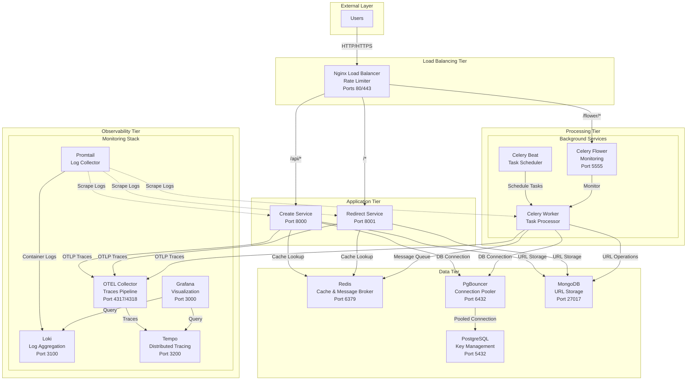
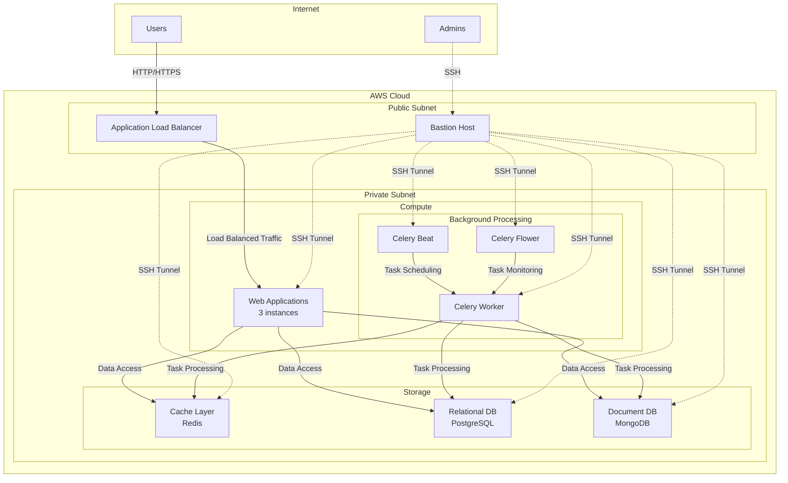

# URL Shortener - Scalable Microservice

A high-performance, scalable URL shortener service built with FastAPI, featuring Redis caching, PostgreSQL for key management, and MongoDB for URL storage.

## 🚀 Features

- **Fast URL Shortening**: Generate short URLs with pre-populated keys for instant response.
- **Redis Caching**: Lightning-fast redirects with Redis-first lookup.
- **Efficient Connection Pooling**: Uses PgBouncer to manage PostgreSQL connections efficiently, reducing overhead and improving performance.
- **Repository Pattern**: A clean and maintainable data access layer using the repository pattern.
- **Efficient Key Pre-population**: A highly efficient key pre-population mechanism that uses a raw SQL query with `unnest` to bulk-insert keys.
- **Dual Database**: PostgreSQL for pre-populating and managing a pool of short URL keys, and MongoDB for storing the mapping between short and long URLs (MongoDB v6.0).
- **Robust Background Processing**: Celery workers with optimized database connections and heartbeat monitoring to ensure reliable task execution.
- **Automated Database Initialization**: The PostgreSQL database is automatically initialized with the required schema on startup.
- **Observability Stack**: Full observability with Tempo for distributed tracing, Loki for log aggregation, Grafana for visualization, and OpenTelemetry instrumentation across all services.
- **Monitoring**: Celery Flower dashboard for task monitoring, accessible via Nginx proxy with proper static asset and API routing.
- **Automated Testing**: Comprehensive `pytest` framework with mocking for robust unit and integration tests.
- **Containerized**: Full Docker setup with docker-compose.
- **Scalable Architecture**: Microservice design ready for horizontal scaling.
- **Load Balancing and Rate Limiting**: Nginx load balancer with rate limiting and caching, including routing for FastAPI documentation and OpenAPI schema.
- **AWS Infrastructure as Code**: AWS infrastructure managed with Pulumi.

## 🏗️ Architecture

### Docker Compose Architecture


```mermaid
graph TD

    subgraph "External Layer"
        U[Users]
    end

    subgraph "Load Balancing Tier"
        H[Nginx Load Balancer<br/>Rate Limiter<br/>Ports 80/443]
    end

    subgraph "Application Tier"
        CS[Create Service<br/>Port 8000]
        RS[Redirect Service<br/>Port 8001]
    end

    subgraph "Processing Tier"
        subgraph "Background Services"
            F[Celery Beat<br/>Task Scheduler]
            E[Celery Worker<br/>Task Processor]
            G[Celery Flower<br/>Monitoring<br/>Port 5555]
        end
    end

    subgraph "Data Tier"
        B[Redis<br/>Cache & Message Broker<br/>Port 6379]
        P[PgBouncer<br/>Connection Pooler<br/>Port 6432]
        C[PostgreSQL<br/>Key Management<br/>Port 5432]
        D[MongoDB<br/>URL Storage<br/>Port 27017]
    end

    subgraph "Observability Tier"
        subgraph "Monitoring Stack"
            L[Loki<br/>Log Aggregation<br/>Port 3100]
            T[Tempo<br/>Distributed Tracing<br/>Port 3200]
            O[OTEL Collector<br/>Traces Pipeline<br/>Port 4317/4318]
            R[Promtail<br/>Log Collector]
            Z[Grafana<br/>Visualization<br/>Port 3000]
        end
    end

    %% User Traffic Flow
    U -->|HTTP/HTTPS| H
    H -->|/api/*| CS
    H -->|/*| RS
    H -->|/flower/*| G

    %% Application Data Access
    CS -->|Cache Lookup| B
    CS -->|DB Connection| P
    P -->|Pooled Connection| C
    CS -->|URL Storage| D
    RS -->|Cache Lookup| B
    RS -->|URL Storage| D

    %% Background Processing Flow
    F -->|Schedule Tasks| E
    E -->|Message Queue| B
    E -->|DB Connection| P
    E -->|URL Operations| D
    G -->|Monitor| E

    %% Observability Flow
    CS -->|OTLP Traces| O
    RS -->|OTLP Traces| O
    E -->|OTLP Traces| O
    O -->|Traces| T
    R -->|Container Logs| L
    R -.->|Scrape Logs| CS
    R -.->|Scrape Logs| RS
    R -.->|Scrape Logs| E
    Z -->|Query| T
    Z -->|Query| L

    class U external
    class H loadTier
    class CS,RS appTier
    class F,E,G processTier
    class B,C,D,P dataTier
    class L,T,O,R,Z observabilityTier
```

### AWS Architecture


```mermaid
graph TD
    subgraph "Internet"
        L[Users]
        M[Admins]
    end

    subgraph "AWS Cloud"
        subgraph "Public Subnet"
            A[Application Load Balancer]
            B[Bastion Host]
        end

        subgraph "Private Subnet"
            subgraph "Compute"
                C[Web Applications<br/>3 instances]
                subgraph "Background Processing"
                    K[Celery Flower]
                    I[Celery Worker]
                    J[Celery Beat]
                end
            end
            
            subgraph "Storage"
                D[Cache Layer<br/>Redis]
                E[Relational DB<br/>PostgreSQL]  
                F[Document DB<br/>MongoDB]
            end
        end
    end

    %% User Traffic Flow
    L -->|HTTP/HTTPS| A
    A -->|Load Balanced Traffic| C

    %% Application Data Access
    C -->|Data Access| D
    C -->|Data Access| E
    C -->|Data Access| F

    %% Background Processing Flow
    J -->|Task Scheduling| I
    K -->|Task Monitoring| I
    I -->|Task Processing| D
    I -->|Task Processing| E
    I -->|Task Processing| F

    %% Admin Access (SSH Tunnels)
    M -.->|SSH| B
    B -.->|SSH Tunnel| C
    B -.->|SSH Tunnel| D
    B -.->|SSH Tunnel| E
    B -.->|SSH Tunnel| F
    B -.->|SSH Tunnel| I
    B -.->|SSH Tunnel| J
    B -.->|SSH Tunnel| K
    
    
    class A,B publicTier
    class C appTier
    class J,I,K processTier
    class D,E,F dataTier
```

## AWS Infrastructure

This project includes a complete AWS infrastructure defined as code using Pulumi. The infrastructure is designed to be scalable, secure, and highly available.

### Deploying the AWS Infrastructure

To deploy the AWS infrastructure, you will need to have Pulumi installed and configured with your AWS credentials. Then, navigate to the `infra` directory and run the following commands:

```bash
cd infra
pulumi up
```

This will provision all the necessary AWS resources, including:

*   A VPC with public and private subnets
*   A NAT gateway for outbound traffic from the private subnets
*   An internet gateway for inbound traffic to the public subnets
*   Security groups to control traffic between the different components
*   EC2 instances for the application, load balancer, databases, and Celery services
*   A bastion host for secure access to the private instances


### Bastion Host and SSH Tunneling

A bastion host is created in the public subnet to allow secure SSH access to the instances in the private subnet. You can connect to the private instances using SSH tunneling through the bastion host. The Pulumi output provides an example command for this:

```bash
ssh -i ../<key_name>.pem -o ProxyCommand="ssh -i ../<key_name>.pem -W %h:%p ubuntu@<bastion_public_ip>" ubuntu@<private_instance_ip>
```

### Celery Security Groups

The security groups for the Celery services are configured to restrict traffic between them:

*   **Celery Worker**: Allows ingress traffic from Celery Beat and Celery Flower, and egress traffic to the databases.
*   **Celery Beat**: Allows ingress traffic for SSH from the bastion host, and egress traffic to the Celery Worker.
*   **Celery Flower**: Allows ingress traffic from the load balancer on port 5555 and for SSH from the bastion host, and egress traffic to the Celery Worker.

### Ansible Deployment

This project uses Ansible to automate the configuration and deployment of the application on the AWS infrastructure provisioned by Pulumi.

**Prerequisites:**
- Ansible installed on your local machine.

**Deployment Steps:**

1.  **Provision Infrastructure:** First, ensure the AWS infrastructure is up and running by using Pulumi as described in the "Deploying the AWS Infrastructure" section.

2.  **Auto-generated Inventory:** The Pulumi script automatically generates the Ansible inventory file (`ansible/inventory/hosts.yml`) and group variables (`ansible/group_vars/all.yml`). You don't need to create or modify these files manually.

3.  **Run the Playbook:** Navigate to the `ansible` directory and run the main playbook:

    ```bash
    cd ansible
    ansible-playbook -i inventory/hosts.yml playbook.yml
    ```

    This command will:
    - Install necessary software on all servers (Docker, Python, etc.).
    - Configure all services (Nginx, PostgreSQL, Redis, MongoDB).
    - Deploy the FastAPI application.
    - Set up and start the Celery workers, beat, and Flower dashboard.

**Note on MongoDB Version:** The Ansible playbook is configured to install MongoDB version 6.0.

**Troubleshooting MongoDB:**
If you encounter issues with MongoDB, you can use the `cleanup_mongodb.sh` script to completely remove and reinstall MongoDB on a server. This script is located in the project root.

```bash
./cleanup_mongodb.sh
```

## Load Balancer and Rate Limiter

This project includes a comprehensive Nginx load balancer and rate limiter configuration. The load balancer distributes traffic across the `create_service` and `redirect_service`, and the rate limiter helps prevent abuse and ensures high availability.

### Running with the Load Balancer

To run the application with the Nginx load balancer, use the `docker-compose-decoupled.yml` file:

```bash
docker-compose -f docker-compose-decoupled.yml up -d
```

This will start the Nginx load balancer, the `create_service`, `redirect_service`, and all the necessary backend services.

### Rate Limiting

The Nginx configuration file `nginx-decoupled.conf` contains the detailed configuration for the load balancer and rate limiter.

## 📋 Prerequisites

- Docker and Docker Compose
- Python 3.12+ (for local development)
- Git
- Pulumi

## 🚀 Quick Start

### Using Docker (Recommended)

1.  **Clone the repository**
    ```bash
    git clone <repository-url>
    cd url_shortener_scalable
    ```

2.  **Start all services**
    ```bash
    docker-compose -f docker-compose-decoupled.yml up -d
    ```

3.  **Start monitoring stack (optional)**
    ```bash
    cd monitoring && docker-compose -f docker-compose-monitoring.yml up -d
    ```

4.  **Verify services are running**
    ```bash
    docker-compose -f docker-compose-decoupled.yml ps
    ```

5.  **Access the application**
    - API: http://localhost/api/v1/create
    - Flower Dashboard: http://localhost/flower
    - API Documentation: http://localhost/docs
    - Grafana Dashboard: http://localhost:3000 (admin/admin)

### Local Development

1.  **Create virtual environment**
    ```bash
    uv venv .venv
    source .venv/bin/activate  # On Windows: .venv\Scripts\activate
    ```

2.  **Install dependencies**
    ```bash
    uv sync
    ```

3.  **Start external services**
    ```bash
    docker-compose -f docker-compose-decoupled.yml up -d redis postgres mongo_db pgbouncer
    ```

4.  **Run the applications**
    ```bash
    # In terminal 1
    uv run create_service.main:app --port 8000 --reload

    # In terminal 2 (Python redirect service)
    uv run redirect_service.main:app --port 8001 --reload

    # OR terminal 2 (Go redirect service - alternative)
    cd redirect-service-go
    go run cmd/server/main.go

    # In terminal 3
    uv run celery -A worker_service.celery_app:celery_app worker --loglevel=info
    ```

### Go Redirect Service

The project includes an alternative Go implementation of the redirect service with the following features:

**Technology Stack:**
- **Chi Router**: Lightweight, fast HTTP router
- **mongo-driver v2**: Official MongoDB driver for Go
- **go-redis v9**: Redis client with connection pooling
- **Circuit Breaker**: Custom implementation for failure protection

**Architecture:**
```
redirect-service-go/
├── cmd/server/main.go       # Entry point with graceful shutdown
├── internal/
│   ├── config/              # Environment-based configuration
│   ├── handler/             # HTTP handlers with request logging
│   ├── service/             # Business logic with cache-aside pattern
│   ├── repository/          # Data access layer (MongoDB, Redis)
│   └── utils/               # Circuit breaker implementation
```

**Running the Go service:**
```bash
cd redirect-service-go
go run cmd/server/main.go
```

**Performance:**
- Cache hit: ~0.9ms (Redis only)
- Cache miss: ~1ms (MongoDB query + Redis cache)
- Sub-1ms latency for cached redirects

**Features:**
- Structured logging for observability
- Graceful shutdown with timeout handling
- Circuit breaker pattern for MongoDB failure protection
- Cache-aside pattern with 30-minute TTL
- Context-aware request handling

## 🔧 Configuration

Key environment variables in `.env`:

| Variable | Description | Default Value |
|---|---|---|
| `MONGO_URI` | MongoDB connection string | `mongodb://localhost:27017` |
| `REDIS_HOST` | Redis host | `localhost` |
| `REDIS_PORT` | Redis port | `6379` |
| `REDIS_PASSWORD` | Redis password | ` ` |
| `DB_NAME` | PostgreSQL database name | `url_shortener` |
| `DB_HOST` | PostgreSQL host | `pgbouncer` |
| `DB_PORT` | PostgreSQL port | `6432` |
| `DB_USER` | PostgreSQL user | `postgres` |
| `DB_PASSWORD` | PostgreSQL password | ` ` |
| `HOST` | Application host | `localhost` |
| `PORT` | Application port | `8000` |
| `BASE_URL` | Base URL for short links | `http://localhost:8000` |
| `KEY_POPULATION_COUNT` | Number of keys to pre-populate | `10` |
| `KEY_BATCH_SIZE` | The batch size for pre-populating keys | `100` |
| `KEY_POPULATION_SCHEDULE` | Schedule for key pre-population (in seconds) | `1800` |
| `TASK_RETRY_DELAY` | Delay for retrying failed tasks (in seconds) | `60` |
| `TASK_MAX_RETRIES` | Maximum number of retries for failed tasks | `3` |
| `CLEANUP_EXPIRED_SCHEDULE` | Schedule for cleaning up expired links (in seconds) | `86400` |
| `CELERY_DB_POOL_SIZE` | Celery database connection pool size | `5` |
| `CELERY_DB_MAX_OVERFLOW` | Celery database connection pool max overflow | `5` |

### Observability Configuration

| Variable | Description | Default Value |
|---|---|---|
| `TRACING_ENABLED` | Enable OpenTelemetry tracing | `true` |
| `SERVICE_NAME` | Service name for tracing | Service-specific |
| `SERVICE_VERSION` | Service version for tracing | `1.0.0` |
| `ENVIRONMENT` | Deployment environment | `development` |
| `OTLP_ENDPOINT` | OpenTelemetry collector endpoint | `http://otel-collector:4317` |


## 📚 API Usage

### Create Short URL

```bash
curl -X POST "http://localhost/api/v1/create" \
  -H "Content-Type: application/json" \
  -d 
  {
    "long_url": "https://www.example.com",
    "expires_at": "2025-12-31T23:59:59"
  }
```

**Response:**
```json
{
  "message": "URL created successfully",
  "short_url": "http://localhost/abc123",
  "long_url": "https://www.example.com",
  "expires_at": "2025-12-31T23:59:59"
}
```

### Access Short URL

Simply visit the short URL in your browser or use curl:

```bash
curl -L "http://localhost/abc123"
```

This will redirect you to the original long URL.

### Health Check

```bash
curl "http://localhost/health"
```

## 🛠️ Services

### Application Services

| Service | Port | Description |
|---|---|---|
| **create_service** | 8000 | FastAPI service for creating URLs |
| **redirect_service** | 8001 | FastAPI service for redirecting URLs |
| **redirect-service-go** | 8001 | (Alternative) Go implementation using Chi router |
| **celery_worker** | - | Background task processor |
| **celery_beat** | - | Periodic task scheduler |
| **celery_flower** | 5555 | Task monitoring dashboard |

### Data Services

| Service | Port | Description |
|---|---|---|
| **redis** | 6379 | Cache for fast URL lookups |
| **pgbouncer** | 6432 | PostgreSQL connection pooler |
| **postgres** | 5432 | Primary database for URL key management |
| **mongo_db** | 27017 | Database for URL storage and analytics (MongoDB v6.0) |

### Observability Services

| Service | Port | Description |
|---|---|---|
| **grafana** | 3000 | Visualization dashboard |
| **tempo** | 3200 | Distributed tracing backend |
| **loki** | 3100 | Log aggregation |
| **otel-collector** | 4317/4318 | OpenTelemetry trace collector |
| **promtail** | - | Docker log collector for Loki |

## 🔄 Background Tasks

The system uses Celery for background processing:

- **Key Pre-population**: Automatically generates unused short URL keys in PostgreSQL using optimized raw SQL strategies.
- **Cleanup Tasks**: Removes expired URLs and maintains database health.

### Query Optimization Strategies

The key pre-population uses a **hybrid strategy** that automatically selects the optimal method based on batch size:

| Batch Size | Strategy | Performance | Use Case |
|------------|----------|-------------|----------|
| < 1,000 keys | Batched inserts | ~1,800 keys/sec | Small top-ups, frequent tasks |
| 1,000 - 50,000 keys | Single INSERT | ~18,000 keys/sec | Medium batches, balanced |
| > 50,000 keys | PostgreSQL generate_series | ~50,000 keys/sec | Bulk initialization, fastest |

**Key Features:**
- **O(1) operation for large batches**: PostgreSQL native method uses `generate_series()` for database-side key generation
- **Automatic failover**: Hybrid strategy chooses the best approach without configuration
- **Full observability**: All operations instrumented with OpenTelemetry tracing
- **Race-condition safe**: Uses `FOR UPDATE SKIP LOCKED` for concurrent-safe key acquisition

**Performance Metrics:**
- 50 keys: 28ms (batched insert)
- 2,000 keys: 110ms (single INSERT)
- 100,000 keys: ~2-3 seconds (PostgreSQL native)

Monitor tasks at: http://localhost:5555/flower

## 🗂️ Project Structure

```
url_shortener_scalable/
├── create_service/        # Service for creating short URLs
│   ├── routes/
│   ├── services/
│   └── Dockerfile
├── redirect_service/      # Service for redirecting short URLs (FastAPI)
│   ├── routes/
│   ├── services/
│   └── Dockerfile
├── redirect-service-go/   # Go implementation of redirect service
│   ├── cmd/server/        # Application entry point
│   ├── internal/
│   │   ├── config/        # Environment configuration
│   │   ├── handler/       # HTTP handlers (Chi router)
│   │   ├── service/       # Business logic layer
│   │   ├── repository/    # Data access (MongoDB, Redis)
│   │   └── utils/         # Circuit breaker implementation
│   ├── go.mod
│   └── .gitignore
├── worker_service/        # Celery worker for background tasks
│   ├── tasks/
│   └── Dockerfile
├── common/                # Common code shared across services
│   ├── core/
│   ├── db/
│   ├── models/
│   └── utils/
├── monitoring/            # Observability stack (Tempo, Loki, Grafana)
│   ├── grafana/           # Grafana dashboard provisioning
│   ├── tempo/             # Tempo tracing configuration
│   └── docker-compose-monitoring.yml
├── ansible/               # Ansible playbooks and roles for deployment
├── tests/                 # Automated tests (unit, integration, API)
├── .dockerignore
├── .gitignore
├── .python-version
├── docker-compose.yml
├── docker-compose-decoupled.yml
├── nginx-decoupled.conf
├── pyproject.toml
├── README.md
└── uv.lock
```

## 📊 Observability

This project includes a comprehensive observability stack for monitoring, tracing, and log aggregation.

### Distributed Tracing with Tempo

- **Tempo**: Distributed tracing backend that stores and queries trace data
- **OpenTelemetry**: Instrumentation library for generating traces across all services
- **Context Propagation**: Automatic trace context propagation across service boundaries

View traces in Grafana at: http://localhost:3000

### Log Aggregation with Loki

- **Loki**: Log aggregation system inspired by Prometheus
- **Promtail**: Log collector that scrapes Docker container logs
- **Structured Logging**: JSON-formatted logs with service context

Query logs in Grafana using LogQL:
```logql
{compose_service="create_service"} |= "ERROR"
```

### Metrics and Visualization

Grafana provides pre-configured dashboards for:
- Distributed traces (service maps, latency, errors)
- Logs (search, filter by labels)
- Service health and performance

### Trace-Log Correlation

Services automatically inject trace IDs into log messages for correlation:
```python
logger.info("Processing URL creation", extra={"trace_id": trace_id})
```

## ⚡ Performance

The URL shortener is optimized for low-latency redirects and high-throughput URL creation.

### Redirect Performance

| Operation | Latency | Notes |
|-----------|---------|-------|
| **Cached redirect** | 5-7ms | Redis cache hit (majority of requests) |
| **Uncached redirect** | ~30ms | MongoDB query + cache population |
| **URL creation** | ~100ms | PostgreSQL key fetch + MongoDB insert |

### Optimization Strategies

**Circuit Breaker Optimization:**
- **Read operations**: Fast-fail without retry delays - eliminates 200-400ms latency spikes
- **Write operations**: Retained retry logic for data integrity
- **Result**: Consistent redirect performance, no unexpected slowdowns

**Key Pre-population:**
- Hybrid strategy auto-selects optimal insertion method based on batch size
- Small batches (<1K): Batched inserts at ~1,800 keys/sec
- Medium batches (1K-50K): Single INSERT at ~18,000 keys/sec
- Large batches (>50K): PostgreSQL native at ~50,000 keys/sec

### Performance Tips

**For production deployments:**
1. **Cache hit rate**: Aim for >90% Redis cache hit rate for sub-10ms redirects
2. **Connection pooling**: Ensure proper pool sizes for PostgreSQL and MongoDB
3. **Monitoring**: Use Grafana dashboards to track latency metrics over time
4. **Horizontal scaling**: Run multiple redirect_service instances behind Nginx

**Performance baseline** (single instance, local development):
```bash
# Test redirect latency
curl -w "TTFB: %{time_starttransfer}s\n" http://localhost/<short_key> -o /dev/null

# Expected: 5-30ms depending on cache status
```

## 🧪 Testing

### Automated Testing

The project now includes a comprehensive automated testing framework using `pytest`.

**Key Features:**
- **Unit and Integration Tests**: Located in the `tests/` directory.
- **Mocking**: Utilizes `mongomock` for MongoDB and `fakeredis` for Redis to enable fast and isolated tests without requiring live database connections.
- **In-memory SQLite**: Uses `sqlite+aiosqlite:///:memory:` for PostgreSQL database testing, ensuring quick and clean test environments.
- **API Testing**: Employs `httpx` for asynchronous API client testing.

**Running Tests:**
To run the automated tests, ensure you have activated your virtual environment and installed test dependencies (if using `uv`'s optional dependencies):

```bash
# If you have optional test dependencies defined in pyproject.toml
uv sync --with test

# Then run pytest
pytest
```

### Manual Testing

The `README.md` provides instructions for manual testing.

### Load Testing

The system is designed to handle high loads through:
- Redis caching for sub-millisecond redirects
- Pre-populated URL keys for instant creation
- Horizontal scaling capabilities
- Efficient database indexing

## 🔧 Development

### Adding New Features

1.  **API Endpoints**: Add routes in `create_service/routes/` or `redirect_service/routes/`
2.  **Background Tasks**: Create tasks in `worker_service/tasks/`
3.  **Database Models**: Update models in `common/db/sql/models.py`
4.  **Services**: Add business logic in `create_service/services/`, `redirect_service/services/`, or `worker_service/`

### Database Migrations

The application automatically initializes the PostgreSQL database on startup. For schema changes, it is recommended to use a database migration tool like `Alembic` to manage schema changes in a production environment. The current setup is suitable for development and testing only.

### Monitoring

- **Grafana Dashboard**: http://localhost:3000 (admin/admin)
  - Distributed traces: View service flows and latency
  - Logs: Search and filter container logs
  - Metrics: Service health and performance
- **Task Monitoring**: http://localhost:5555 (Celery Flower)
- **Application Logs**: View in Grafana Loki or via `docker-compose logs <service>`
- **Database Health**: Check via health endpoint

#### API Monitoring Endpoints

| Endpoint | Description | Response |
|----------|-------------|----------|
| `GET /monitoring/health/detailed` | Comprehensive health check of all services | JSON with DB, cache, and key pool status |
| `GET /monitoring/pool/status` | PostgreSQL connection pool metrics | Pool size, utilization, recommendations |
| `GET /monitoring/mongodb/stats` | MongoDB connection and database statistics | Pool stats, collection counts, storage size |
| `GET /monitoring/key/analytics` | Key usage analytics | Total/used keys, usage percentage, recommendations |

**Example:**
```bash
curl http://localhost:8000/monitoring/health/detailed
# Returns: {"status": "healthy", "checks": {"postgresql": {...}, "mongodb": {...}, ...}}
```

## 🚀 Deployment

### Production Considerations

1.  **Environment Variables**: Use secure values in production
2.  **SSL/TLS**: Configure HTTPS for production domains
3.  **Database**: Use managed database services
4.  **Caching**: Consider Redis Cluster for high availability
5.  **Monitoring**: Add application performance monitoring
6.  **Scaling**: Use container orchestration (Kubernetes, Docker Swarm)

### Docker Production

```bash
# Build production image
docker-compose -f docker-compose.prod.yml build

# Deploy with production config
docker-compose -f docker-compose.prod.yml up -d
```

## 🤝 Contributing

1. Fork the repository
2. Create a feature branch (`git checkout -b feature/amazing-feature`)
3. Commit your changes (`git commit -m 'Add amazing feature'`)
4. Push to the branch (`git push origin feature/amazing-feature`)
5. Open a Pull Request

## 📄 License

This project is licensed under the MIT License - see the LICENSE file for details.

## 🙏 Acknowledgments

- Built with [FastAPI](https://fastapi.tiangolo.com/)
- Task processing by [Celery](https://celeryproject.org/)
- Caching powered by [Redis](https://redis.io/)
- Database management with [PostgreSQL](https://postgresql.org/) and [MongoDB](https://mongodb.com/)
- Package management by [uv](https://github.com/astral-sh/uv)

---

## 📞 Support

For questions and support:
- Create an issue in the repository
- Check the API documentation at http://localhost:8000/docs
- Monitor system health at http://localhost:8000/health